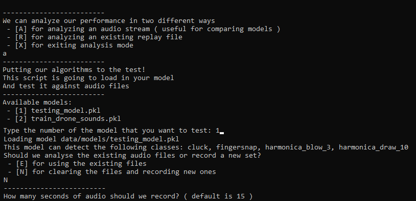
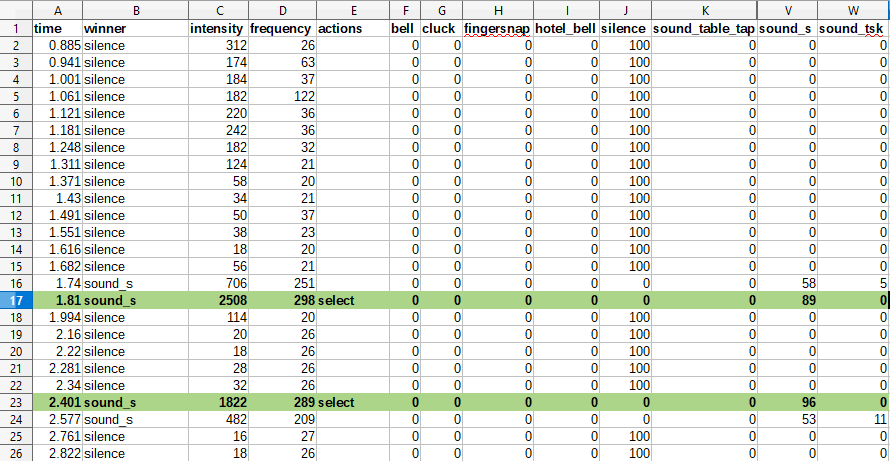

# Analysing a models performance
---

Training a model and checking for its perceived accuracy is one thing, but to properly test if it fits your needs, you will have to try it out.
You can do this by following the [A] menu in the `py settings.py` command. In here, you can analyse the results and the predictions of your generated model.

There are two routes to take, the replay route and the audio analyse route. Both will result in generating a graph where you can detect if a sound is being detected well.
For this guide, we will follow the [A] route, which will let us record a couple of seconds of sound.

Pick the model you want to see the predictions of, and then pick whether or not you want to generate a new recording for testing, or use the previously generated one.
The latter option is nice to have for comparing whether or not a newly generated model is better than a previous model.

Once the predicting is done, a set of charts will be generated. The graph below is composed of audio information, showing off the loudness and frequency values.
The above graph however contains the most information about our models predictions. We will use the above example to do an analysis of the given sounds.

On the left, we can see two distinct areas, a set of orange lines and a set of deep blue lines. If we look at the legend, these seem to be label 'S' and 'F' respectively.
Considering that the bars are almost completely one colour, the algorithm is pretty sure that it has hear these sounds, and it is correct according to my memory of this test.

These bars are followed by two sets of smaller lines, the green ones showing the 'SH' sound. While they aren't as big as the previous ones, it can still be predicted distinctly from the rest.
Remember, we don't need to be 100% accurate on every sound, we can tune some of the thresholds for the sound activation in a later stage.

A few spots over near file 80, we can see a few bits of yellow, corresponding to the 'finger snap' sound. Below in the audio graph we can see two very loud sounds. So it is safe to say that this equates to the finger snap sound.
However, the model isn't able to really tell it apart from the other sounds. In the first and third area, it is hardly able to break the 20% sureness level. This means that the sound is most likely to be a bad candidate for recognition.
Using the finger snap would result in a lot of misclicks, actions not registering and other unintended actions firing up.

It is best we leave that sound out of our model when we next retrain it like in Step 2.

Replays
----

On top of being able to do analysis using the graph, you can also analyse replays it has generated during a play or analysing session.
These are spreadsheet files located in the replays folder ( default is data/replays - This can be changed in config/config.py ).

In here you can see the actual percentages of the predictions, at what time it predicted what sound, and which action resulted from that sound.
On row 16 we can see that the 'S' sound was detected with a percentage of 58 percent. Perhaps we want the 'select' action to fire more easily when this sound is being recognized.
So we could tweak the detection thresholds to be around 55 in this case so the select action would fire more rapidly.

We can also see how long it took in between recordings for the program to finish processing a bit of sound.
From row 15 to row 16, we can see that they happened respectively at 1682 and 1740 milliseconds after the start of the session. This means it took around 60 milliseconds to complete a cycle.
You can expect an input lag of around 58 milliseconds this way. 

Because row 16 isn't recognized as a select action however, it might have actually taken 128 milliseconds to register the action. 
As you can see, because of the way the thresholds work, it isn't possible to predict with certainty how much input lag the program has as a whole.

