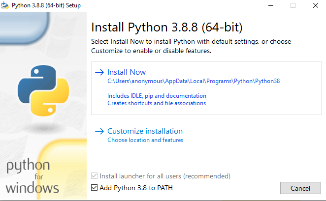
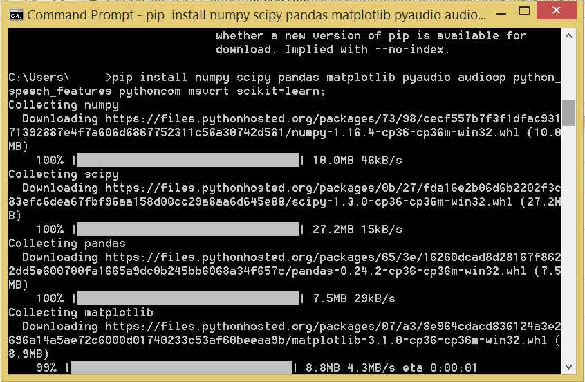

# Installation guide
==================

For this program to work, you must atleast have access to a microphone and a Windows machine that can run Python 3.6 32 bit.

Do note that this guide only details how to set up the base installation of this program ( i.e. being able to run the program without random crashes ). 
There are no ready-made audio recognition models added to this installation, you will have to make those yourself using the settings menu.
You will also have to change the modes to your own needs.

Step one - Installing python
----------



This can be done by following the [Python installation link](https://www.python.org/downloads/release/python-360/) and selecting your desired way of installing - I used the Windows x86 executable installer option.
Make sure you have the checkbox 'Add Python 3.6 to PATH' enabled and pick the Install Now option. 

Step two - Installing all the packages
---------



Now that you have python installed, you can use it to download packages. Open a command line program ( Search for cmd in your Windows search box ) and test if your python is installed properly.
This can be done by typing 'python -v', this will display the version of your current python installation.

If all else is well, install the packages below by running the following lines of code in your command line program: 

```pip3 install numpy;
pip3 install scipy;
pip3 install pandas;
pip3 install matplotlib;
pip3 install pyaudio;
pip3 install pyautogui;
pip3 install python_speech_features;
pip3 install pythoncom;
pip3 install joblib;
pip3 install scikit-learn;
pip3 install pywin32;```

Step three - Download and extract the zipfile from this github repository
---------------


Now download the zip of this github repository and save it somewhere on your computer. It doesn't need to be in program files or anything, it can just be on your desktop.
Extract the files in another folder and you can start testing the settings menu.
Navigate to the directory in your command line tool by using `cd YOUR_PATH_TO_PARROT_PY_DIRECTORY` and then run `py settings.py`.
If it shows the options menu, you should be able to run all the recording, training and analysis tools.

Step four - Installing the speech recognition package
---------------

In order to make use of the speech recognition capabilities of the program, you need to install one more package called dragonfly. Unfortunately, this package can't be installed from the command line ( to my knowledge ).
So what you're going to have to do is download the zipfile from the link below and extract it somewhere on your computer.

https://github.com/sathishkottravel/dragonfly

Then open up that directory in your command line program and run the installer using `py setup.py install` . This will install all the required packages and should set you up properly

Step five - Training Windows Speech recognition
---------------

Before you can make use of the speech recognition part, you will have to train Windows Speech recognition on your microphone and your voice.
You can do this by opening up windows speech recognition and following their installation instructions. 
You can also use Dragon Speech Naturally if you want more proper dictation possibilities, but for short commands, windows speech recognition functions just fine.

With all these steps followed, you can run the `py play.py` command on your command line tool to run the program. But first, you will have to tweak your settings to match your needs. 

Optional - Download NIRCMD.exe and place it inside the root folder
----------------

This executable allows the program to more easily toggle the system volume. If you don't need this functionality, it isn't required.

Optional - Install the eyetracker software
---------------

To be able to move your mouse cursor without using your hands, you must have access to an eyetracker and a way to map the cursor roughly to the place where you are looking.
For this, I use the Tobii Eye Tracker 4C and a seperate program called Project IRIS. The latter can be trialed for about a month before you have to purchase it.
I haven't tried any other eye tracker, but this one seems just fine for this program.

Follow their installation instructions and make sure you can toggle your mouse cursor following by pressing a key - I have F4 configured to toggle it