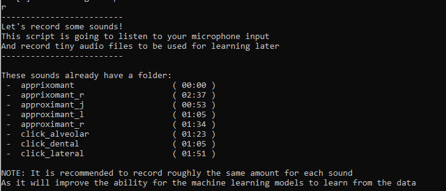
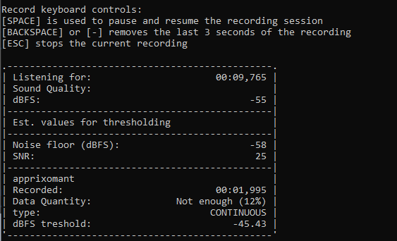

# Recording sound files
----

In order to train a model, you need to record sounds first. You can do this by running `py settings.py` and pressing the [R] key, this will lead you through the steps neccesary for recording.

This script will record sounds in seperate files of 30 milliseconds each and save them in your recordings folder ( data/recordings is the default place, which can be changed in the data/code/config.py file using the examples in lib/default_conifg.py ). 
You have to be sure to record as little noise as possible. For example, if you are recording a bell sound, it is imperative that you only record that sound.
If you accidentally recorded a different sound, you can always delete the specific file from the recordings directory.

In order to make sure you only record the sound you want to record, you can alter the power setting at the start. I usually choose a value between 1000 and 2000. 
You can also trim out stuff below a specific frequency value. Neither the intensity, power or the frequency values I am using isn't actually an SI unit like dB or Hz, just some rough calculations which will go up when the loudness or frequency goes up.

During the recording, you can also pause the recording using SPACE or quit it using ESC. If you feel a sneeze coming up, or a car passes by, you can press these keys to make sure you don't have to prune away a lot of files.

### Amount of data needed

I found that you need around 30 seconds of recorded sound, roughly 1000 samples, to get a working recognition of a specific sound. Depending on the noise it would take between a minute and two minutes to record the sounds ( there are less samples to pick from with short sounds like clicks, whereas longer sounds like vowels give more samples ).
You will start getting diminishing returns past two and a half minutes of recorded sound ( 5000 samples ), but the returns are still there. As of the moment of this writing, I used 15000 samples for the Hollow Knight demo.
You can try any amount and see if they recognize well.

From this version onward, there will also be full recordings of the recording session saved in the source directory inside of the sound you are recording. This might come in handy when we start adding more sophisticated models in the future.

[Step 2 - Training the model](TRAINING.md)